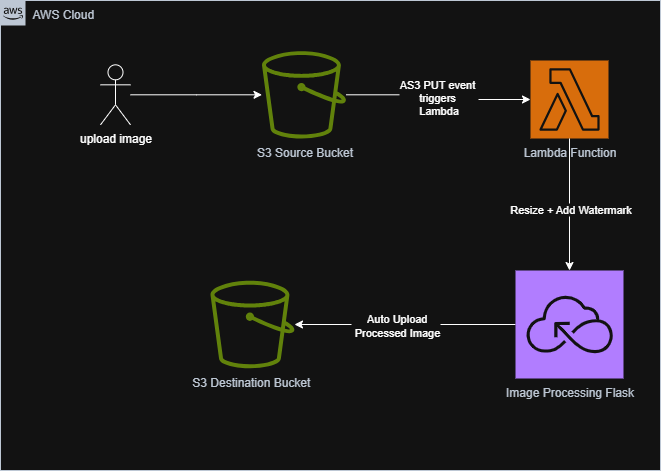

# Serverless Image Processing with S3 and Lambda

## Project Overview
This project implements a **serverless image processing application** where users upload images to an S3 bucket, which triggers an AWS Lambda function that processes the images (resize, watermark) and stores them in another S3 bucket.

### Key AWS Services
- **Amazon S3**: Stores original and processed images.
- **AWS Lambda**: Executes image processing logic.
- **Optional EC2/Flask Imgproxy**: Handles advanced image processing if needed.

---

## Architecture Diagram


**Description:**
1. **User uploads image** → S3 Source Bucket. (you can use upload.py code  only to send image unprossced to s3 source)
2. **S3 triggers Lambda** → Lambda retrieves the image.
3. **Image is processed** → Resized and Watermarked.
4. **Processed image uploaded** → S3 Destination Bucket.
5. **Optional**: Imgproxy on EC2 can handle processing if Lambda lacks required libraries.

---

## Project Structure
serverless-image-processing/
├─ README.md
├─ lambda_function.py
├─ opload.py  
├─ architecture-diagram.png
└─ scripts/
└─ flask_imgproxy.py

---

## Setup Instructions

### 1. S3 Buckets
- Create **Source Bucket** and **Destination Bucket**.
- Set **S3 trigger** on Source Bucket to invoke Lambda on `PUT` events.

### 2. Lambda Function
- Copy `lambda_function.py` code into AWS Lambda.
- Set handler: `lambda_function.lambda_handler`.
- Add environment variables:
  - `SOURCE_BUCKET=<source_bucket_name>`
  - `DEST_BUCKET=<destination_bucket_name>`
  - `IMG_PROXY_URL=<EC2_IP_or_Imgproxy_URL>`
- Timeout: 10+ seconds
- Memory: 128 MB or higher

### 3. Flask Imgproxy (Optional)
- Place `flask_imgproxy.py` on an EC2 instance.
- Install dependencies:
```bash
sudo yum install python3 -y
python3 -m pip install --user flask pillow

